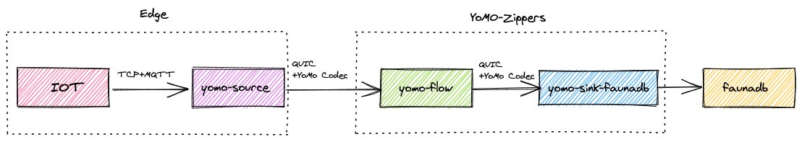
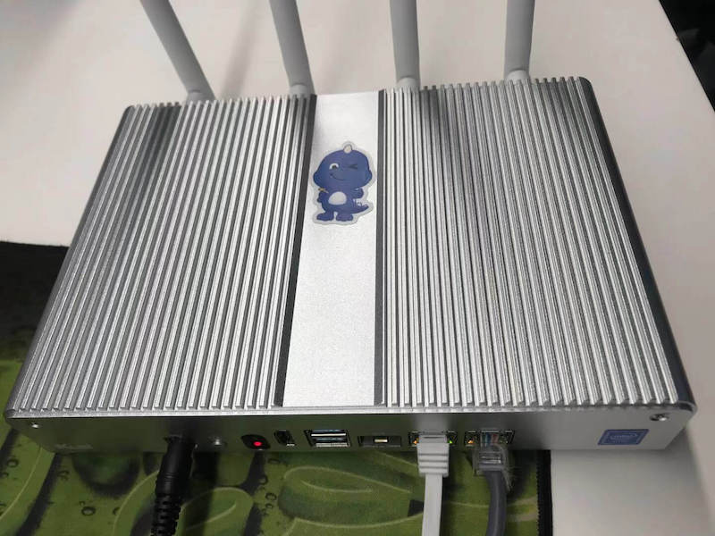
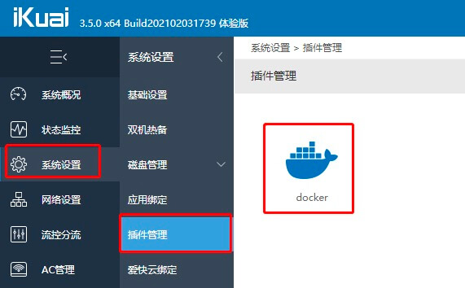
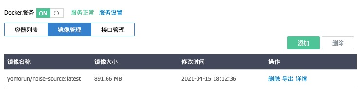
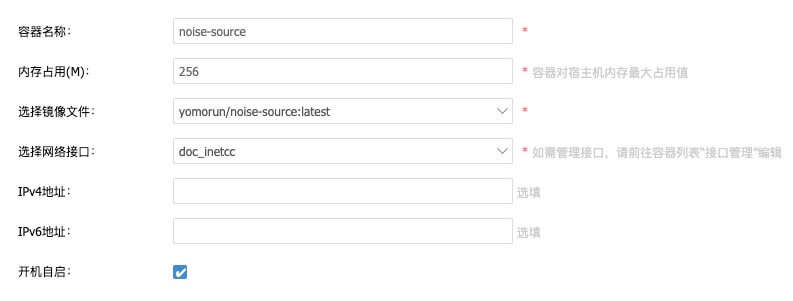
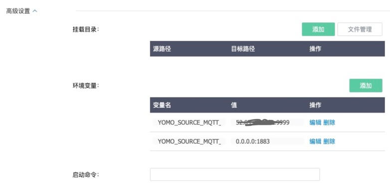
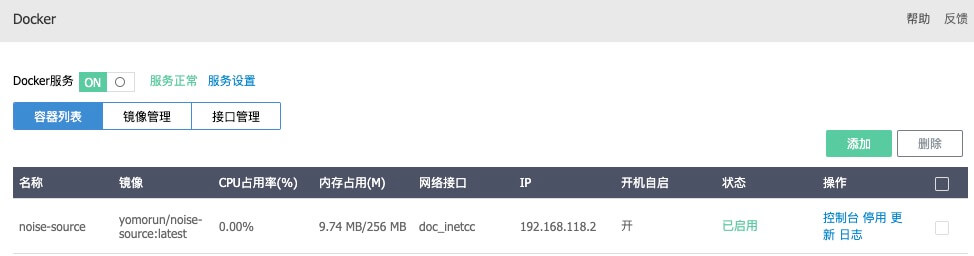

# iKuai+YoMo 边缘计算赋能工业互联网

前言：iKuai的新版本系统新增了对Docker的支持，借助这个能力，在iKuai路由器上部署基于YoMo编写的Serverless应用，大幅推动了边缘计算和物联网在工业互联网中的应用价值。

工业互联网在中国发展势头强劲，而反观整个底层技术，如TCP、MQTT等协议仍是20多年前的产物，在技术飞速发展的今天，更好的网络基础设施，更优秀的技术栈，伴随消费互联网的高度普及，已是大幅提升。新版本的iKuai路由器，借助Docker技术，实现了灵活部署基于YoMo框架开发的Serverless应用，将边缘计算能力以最简单的方式提供给工业客户，帮助用户在保证数据隐私安全的前提下，构建低时延的物联网实时计算应用。

## YoMo

[YoMo](https://yomo.run/zh) 是一个为边缘计算领域打造的低时延流式数据处理框架，基于 QUIC 协议通讯，以 Functional Reactive Programming 为编程范式，构建可靠、安全的低时延实时计算应用，挖掘 5G 潜力，释放实时计算价值。



在具体的落地场景中，往往要把[yomo-source](https://yomo.run/zh/source)部署到靠近IoT设备的边缘端，以便收集物联网设备发送的数据，再通过yomo的流式框架向云端的工作流引擎(zipper)进行实时的传输，满足后续业务逻辑处理的需要。

为了接收支持MQTT协议的IoT设备的传输需求，我们实现了[quic-mqtt](https://github.com/yomorun/yomo-source-mqtt-starter)的兼容转换，只要设备支持MQTT协议，便可以开发一个简单的应用来接收该设备发送出来的数据，并可无缝接入YoMo框架体系中。

本文将以**[噪声传感器](https://github.com/yomorun/example-noise)**为例，看看如何落地这一部署？

## 开发一个应用

我们首先要开发一个应用来接收设备发送出来的MQTT协议数据，这里我们已经开发出一个项目[yomo-source-noise-example](https://github.com/yomorun/yomo-source-noise-example)以方便地构建一个接收MQTT数据接收器，具体可以看看这个例子的代码：`main.go`

```go
package main

import (
	"encoding/json"
	"log"
	"os"

	"github.com/yomorun/y3-codec-golang"
	"github.com/yomorun/yomo-source-mqtt-starter/pkg/utils"

	"github.com/yomorun/yomo-source-mqtt-starter/pkg/receiver"
)

type NoiseData struct {
	Noise float32 `y3:"0x11"` // Noise value
	Time  int64   `y3:"0x12"` // Timestamp (ms)
	From  string  `y3:"0x13"` // Source IP
}

func main() {
	handler := func(topic string, payload []byte, writer receiver.ISourceWriter) error {
		log.Printf("receive: topic=%v, payload=%v\n", topic, string(payload))

		// 1.get data from MQTT
		var raw map[string]int32
		err := json.Unmarshal(payload, &raw)
		if err != nil {
			log.Printf("Unmarshal payload error:%v", err)
		}

		// 2.generate y3-codec format
		noise := float32(raw["noise"])
		data := NoiseData{Noise: noise, Time: utils.Now(), From: utils.IpAddr()}
		sendingBuf, _ := y3.NewCodec(0x10).Marshal(data)

		// 3.send data to remote workflow engine
		_, err = writer.Write(sendingBuf)
		if err != nil {
			log.Printf("stream.Write error: %v, sendingBuf=%#x\n", err, sendingBuf)
			return err
		}

		log.Printf("write: sendingBuf=%#v\n", sendingBuf)
		return nil
	}

	receiver.CreateRunner(os.Getenv("YOMO_SOURCE_MQTT_ZIPPER_ADDR")).
		WithServerAddr(os.Getenv("YOMO_SOURCE_MQTT_SERVER_ADDR")).
		WithHandler(handler).
		Run()
}
```

从这个例子代码可见，我们假设从IoT设备输出了一个JSON数据`{"noise":456}`到我们的yomo-source服务中，通过使用[y3-codec](https://github.com/yomorun/y3-codec-golang)进行格式转换后便可以通过Write发送给在远端的工作流引擎(zipper)，该地址通过环境变量`YOMO_SOURCE_MQTT_ZIPPER_ADDR`定义，而yomo-source本身这个服务则通过`YOMO_SOURCE_MQTT_SERVER_ADDR`定义，当然你也可以不设置，默认监听本地的1883端口。

如果想现在就运行起这个服务，我们可以简单的运行下下面命令:

```go
go mod init source
go get github.com/yomorun/yomo-source-mqtt-starter
YOMO_SOURCE_MQTT_ZIPPER_ADDR={Your Zipper Addr}:9999 YOMO_SOURCE_MQTT_SERVER_ADDR=0.0.0.0:1883 go run main.go
```

虽然我们可以本地跑起来，但是有一个问题：我们该如何部署在边缘端？众所周知，路由器是私有网络和公有网络的桥梁，如果有一个足够强大的路由器设置能跑起这样的服务该多好，那么所有的数据都可以在发送给云端数据前被接收和转换了；另外，如果这个路由器还能支持Docker容器化部署，那就完美了，可以不用考虑边缘端设备的环境兼容问题，经一番查找后终于找到了这款**[爱快路由器](https://www.ikuai8.com/)**能瞒足这个需求，非常幸运，接下来我们就一起看看如何使用爱快路由器部署我们的yomo-source实现[**yomo**](https://github.com/yomorun/yomo)在边缘端的落地吧！

# 爱快容器化部署

参考：**[插件管理](https://www.ikuai8.com/zhic/ymgn/lyym/xtsz/2021-03-08-07-27-41.html)**	 **[重大更新！爱快3.5版本今日正式上线](https://bbs.ikuai8.com/thread-122298-1-1.html)**   

先来看看爱快路由器的美照吧




这款路由器的大小跟普通路由器大小差不多，但是功能却很强大，自定义能力很强，具体怎么用的细节这里就不介绍了，可以看看他们的[官网](https://www.ikuai8.com/)，这里主要还是关心如何容器化部署我们的服务。


## 安装Docker插件

得益于他们的插件管理机制，可以在插件市场中直接安装Docker插件，找到官方的[一篇文章](https://www.ikuai8.com/zhic/ymgn/lyym/xtsz/2021-03-08-07-27-41.html)描述如何安装该插件，这里就不重复了，总的来讲就是方便快捷，安装完插件后就可以显示出Docker来了。




## 添加镜像

Docker插件支持`本地上传`和`镜像库下载`两种方式，我们就分别讲一下如何通过这两种方式添加镜像到路由器中。

### 本地上传

本上传的方式速试是最快了，毕竟路由器就在边上，要做的工作首先是`构建`和`打包`镜像文件，然后上传到路由器的文件系统中。

#### 编写Dockerfile文件

这里我们已经提供了一个基础镜像[**quic-mqtt**](https://hub.docker.com/repository/docker/yomorun/quic-mqtt)，方便开发者编写自已的Dockerfile文件，开发者可以看看链接中的说明，这里直接给出本次Noise例子代码的Dockerfile写法：

```dockerfile
FROM yomorun/quic-mqtt:latest

COPY main.go .
RUN go get -d -v ./...

CMD ["sh", "-c", "go run main.go"]
```

通过FROM我们的基础镜像，已经内置了golang的运行时环境，以及兼容MQTT协议的组件。

#### 构建镜像

```bash
docker build -f Dockerfile -t yomorun/noise-source:latest .
```

#### 打包镜像文件

```bash
docker save yomorun/noise-source:latest -o noise-source.tar
```

这样就把本地镜像打包成一个tar文件，以备上传。

#### 上传镜像文件

可以按这个步骤上传我们的镜像文件：

「磁盘管理」 -->「文件管理」 --> 「选择保存的目录」 --> 「点击上传」  --> 「选择本地文件」  --> 「成功上传」 --> 「查看路径」--> 「复制」

这样就复制出我们上传镜像文件后在路由器中的路径了，如：`/cc/images/noise-source.tar`

#### 添加镜像

步骤如下：

「插件管理」--> 「docker」--> 「镜像管理」--> 「添加」--> 「选择引用路径」--> 「填写文件路径: /cc/images/noise-source.tar」--> 「确认」

经过稍许等待，就提示上传成功，显示如下成功的镜像了：




这种方式是上传最快的方式，不过对于真实部署来说，通过镜像库就更为实用些。

### 镜像库下载

有了上面的构建的`yomorun/noise-source:latest`镜像，接下来的步骤就简单些了，主要是上传镜像到hub.docker.com，然后在路由器中下载。

#### 上传到镜像库

这里假设你已经在hub.docker.com中注册了帐号了，只需要运行这些命令即可：

```bash
docker login -u yomorun -p {PWD}
docker push yomorun/noise-source:latest
```

#### 下载镜像

回到路由器，我们就要以通过以下步骤下载镜像库了：

「插件管理」--> 「docker」--> 「镜像管理」--> 「添加」--> 「选择镜像库下载」--> 「搜索yomorun就要以列出相关的容器列表」--> 「选择yomorun/noise-source」--> 「下载」

都完成后可以查看到下载好的镜像了

## 创建容器

步骤如下：

「插件管理」--> 「docker」--> 「容器列表」--> 「添加」

填写如下图信息：







回到容器列表界面，可以看到运行中的容器了



