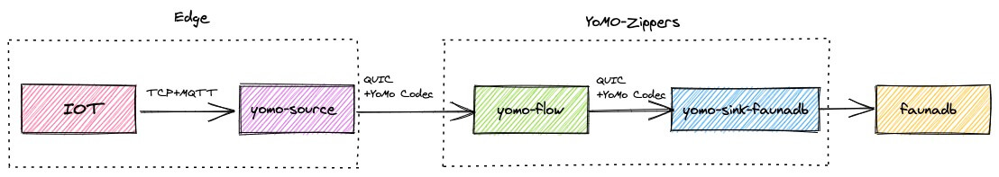

# Quick reference (cont.)

- **Use it for**: https://github.com/yomorun/yomo
- **Where to file issues**: https://github.com/yomorun/yomo-source-mqtt-starter/issues
- **Source of this description**: https://github.com/yomorun/yomo-source-mqtt-starter


# What is QUIC-MQTT?

The QUIC-MQTT image is a containerization of the project [yomo-source-mqtt-starter](https://github.com/yomorun/yomo-source-mqtt-starter). Using this image you can easily deploy the [YoMo](https://github.com/yomorun/yomo) Source service for receiving data from MQTT protocol devices.


# How to use this image


## write an application

refer to [README.md](https://github.com/yomorun/yomo-source-mqtt-starter/blob/main/README.md) to write a go file. This is a minimalist example: `main.go`

```go
package main

import (
	"os"

	"github.com/yomorun/yomo-source-mqtt-starter/pkg/receiver"
)

func main() {
	receiver.CreateRunner(os.Getenv("YOMO_SOURCE_MQTT_ZIPPER_ADDR")).Run()
}
```

- **YOMO_SOURCE_MQTT_ZIPPER_ADDR**: service address for workflow engine zipper, You can see the architecture diagram:

  

## write a Dockerfile file

`Dockerfile`

```dockerfile
FROM yomorun/quic-mqtt:latest

COPY ./main.go .
RUN go get -d -v ./...

CMD ["sh", "-c", "go run main.go"]
```


## build an image

```bash
docker build -f Dockerfile -t local/hello-source:latest .
```


## run the container

```bash
docker run --rm --name hello-source \
  -e YOMO_SOURCE_MQTT_ZIPPER_ADDR=192.168.108.100:9999 \
  local/hello-source:latest
```


# How to publish to Docker Hub

For easy deployment, you can upload to hub.docker.com to make it easy to download and use directly on your device.

```bash
docker tag local/hello-source:latest {USER}/hello-source:latest
docker login -u {USER} -p {PWD}
docker push {USER}/hello-source:latest
```


# License

View [license information](https://github.com/yomorun/yomo/blob/master/LICENSE) for the software contained in this image.

As with all Docker images, these likely also contain other software which may be under other licenses (such as Bash, etc from the base distribution, along with any direct or indirect dependencies of the primary software being contained).

Some additional license information which was able to be auto-detected might be found in [the `repo-info` repository's `quic-mqtt/` directory](https://github.com/yomorun/yomo-source-mqtt-starter).

As for any pre-built image usage, it is the image user's responsibility to ensure that any use of this image complies with any relevant licenses for all software contained within.

