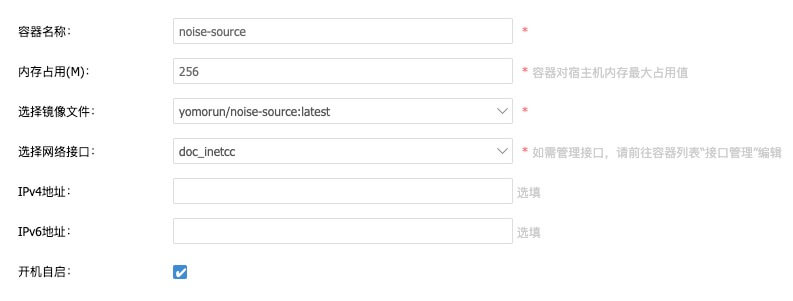
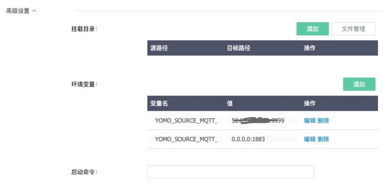

# 工业互联网中的数据采集


# 数据采集

工业企业数据只有20%是来自互联网，80%是企业自身拥有的生产经营等环节数据。如何采集到这些数据，以及采集到数据的数量和质量，很大程度上决定了工业互联网的价值。


数据可能来源于各种传感器设备或者数控机床，甚至人工终端反馈；但采集的数据要能高效的传输到数据处理平台才能有效发挥数据驱动带来的红利。数据处理平台有远有近，近的可以是落在边缘上的计算节点或者私有网络中的服务，远的可以是公有云上的接收服务；但无论远近都涉及的现实是传统的Wi-Fi和移动网络的不稳定性，在延时率大、丢包率高和带宽不足的弱网环境下如何实时高效的传输数据对于数据的有效利用是至关重要，即使在未来的5G和Wi-Fi的先进网络中实时高效的传输方式才更能发挥数据驱动的优势，特别对于危险的特种行业(如: 危险品检测)，实时性更是重中之重。


## 采集架构

在传统的传感器或者采集网关中不少支持MQTT协议，这里我们以该协议在传统采集架构的应用为例说明为什么需要更为实时高效的数据采集方式，以下为一个典型的基于MQTT的采集架构。


从图中我们发现基于MQTT的订阅发布模式构建的数据采集和处理架构存在一些需要改进的地方：

- 中心化的Broker通常会部署在云端，这样导致基于MQTT协议的数据传输跨越了公网或者弱网，因为该协议是基于TCP协议构建，而TCP在弱网环境中存在[队头阻塞](https://github.com/rmarx/holblocking-blogpost)、建立连接慢等一些导致网络不稳定的问题。
- 通常基于MQTT协议时传输JSON的数据，这样总体传输的数据包大。
- 不支持视频和文件的流式传输，实现上还是请求响应模式，并不支持原生的流式数据处理。
- 基于发布订阅不支持点对点的通信，可以对订阅同一主题的设备数据进行监听。
- 缺乏工作流引擎，多倾向于简单的数据收集存储，对于复杂的涉及不同节点处理的联动操作显得无力或者实现复杂。

应对这些不足的地方，这里介绍一款为边缘计算领域打造的低时延流式数据处理框架[YoMo](https://yomo.run/zh) ，它基于 QUIC 协议通讯，以 Functional Reactive Programming 为编程范式，构建可靠、安全的低时延实时计算应用，挖掘 5G 潜力，释放实时计算价值。部署这套开源框架的架构如下：


如图所示，基于原生流式数据处理具备显著的特点：

- 全链路基于[QUIC](https://zh.wikipedia.org/wiki/QUIC)协议构建的流式处理引擎，提供实时的流式数据传输。相比于TCP构建的MQTT信息发布至少有如下优点:
  - 避免队头阻塞的多路复用。
  - 更快地建立连接，减少了TCP及TLS 握手时间。
  - 改进的拥塞控制。
  - 连接迁移。
  - 前向冗余纠错。

- 全链路应用TLS1.3加密传输，提供了安全的保证。
- 全链路使用[Y3](https://github.com/yomorun/y3-codec-golang)的编解码器，原生适配流传输需求，提供比JSON甚至PD更快的解码效率。
- 提供出色的流处理工作引擎，用户编写简单的Serverless函数即可为业务逻辑编排满足业务需求的工作流(Flow)；也可以把分析处理完的数据落地到各种存储、监控甚至其它云端服务；当然也可以通过双向连接对分析数据后需要执行的动作发回设备执行相应的应对操作。
- 整个处理流程角色分明(Source/Zippe/Flow/Sink)，易于理解，每个部分都可以进行扩展和重用通用的组件。


如果想进一步了解YoMo框架及使用案例，可以查看他们的官网，提供链接如下：

- https://yomo.run
- https://github.com/yomorun/yomo
- https://github.com/yomorun/y3-codec-golang


# 例子(噪音传感器)

这里通过在边缘端部署`噪音传感器`这个案例来说明YoMo在数据采集部分的应用场景，先看看这个案例的总体架构。


图中描述了流程如下：

- 在边缘端的`设备网关`定时向`噪声传感器`收集数据，并向我们的Source发送MQTT协议的数据。
- Source服务接收到数据后转换成Y3的编码，以QUIC流的方式向云端的工作流引擎Zipper传输数据，这步利用了YoMo的可靠、安全和低时延的优势，同时数据具体更高的编码压缩率。
- 在Zipper工作流的编排下，数据会先流向数据处理Flow进行数据计算和采样处理。
- 经过Flow处理后的数据再次让工作流调度到数据输出的Sink服务，该服务以WebSocket的方式提供查询服务。
- 一个展示网站通过WebSocket连接到Sink上展示实时的噪声数据和延时值。

项目对应的代码：

- Source: https://github.com/yomorun/yomo-source-mqtt-starter `/cmd/noise/main.go`
- Zipper: https://github.com/yomorun/yomo `/example/workflow.yaml`
- Flow: https://github.com/yomorun/yomo  `/example/flow/app.go`
- Sink: https://github.com/yomorun/yomo-sink-socketio-server-example
- 展示: https://github.com/yomorun/yomo-sink-socket-io-example

查看以上代码可以了解本案例的详细开发，但本文只重点关注数据采集和展示这个环节，看看如何落地这一部署？


为了接收支持MQTT协议的IoT设备的传输需求，我们实现了[quic-mqtt](https://github.com/yomorun/yomo-source-mqtt-starter)的兼容转换，只要设备支持MQTT协议，便可以开发一个简单的应用来接收该设备发送出来的数据，并可无缝接入YoMo框架体系中。


## 开发Source

我们首先要开发一个应用来接收设备发送出来的MQTT协议数据，这里我们已经开发出一个项目[yomo-source-mqtt-starter](https://github.com/yomorun/yomo-source-mqtt-starter)以方便地构建一个应用，具体可以看看这个[Noise例子](https://github.com/yomorun/yomo-source-mqtt-starter/blob/main/README_CN.md)的代码：`main.go`

```go
package main

import (
	"encoding/json"
	"log"
	"os"

	"github.com/yomorun/y3-codec-golang"
	"github.com/yomorun/yomo-source-mqtt-starter/pkg/utils"

	"github.com/yomorun/yomo-source-mqtt-starter/pkg/receiver"
)

type NoiseData struct {
	Noise float32 `y3:"0x11"` // Noise value
	Time  int64   `y3:"0x12"` // Timestamp (ms)
	From  string  `y3:"0x13"` // Source IP
}

func main() {
	handler := func(topic string, payload []byte, writer receiver.ISourceWriter) error {
		log.Printf("receive: topic=%v, payload=%v\n", topic, string(payload))

		// get data from MQTT
		var raw map[string]int32
		err := json.Unmarshal(payload, &raw)
		if err != nil {
			log.Printf("Unmarshal payload error:%v", err)
		}

		// generate y3-codec format
		noise := float32(raw["noise"])
		data := NoiseData{Noise: noise, Time: utils.Now(), From: utils.IpAddr()}
		sendingBuf, _ := y3.NewCodec(0x10).Marshal(data)

		_, err = writer.Write(sendingBuf)
		if err != nil {
			log.Printf("stream.Write error: %v, sendingBuf=%#x\n", err, sendingBuf)
			return err
		}

		log.Printf("write: sendingBuf=%#v\n", sendingBuf)
		return nil
	}

	receiver.CreateRunner(os.Getenv("YOMO_SOURCE_MQTT_ZIPPER_ADDR")).
		WithServerAddr(os.Getenv("YOMO_SOURCE_MQTT_SERVER_ADDR")).
		WithHandler(handler).
		Run()
}
```

从这个例子代码可见，我们假设从IoT设备输出了一个JSON数据`{"noise":456}`到我们的yomo-source服务中，通过使用[y3-codec](https://github.com/yomorun/y3-codec-golang)进行格式转换后便可以通过Write发送给在远端的工作流引擎(zipper)，该地址通过环境变量`YOMO_SOURCE_MQTT_ZIPPER_ADDR`定义，而yomo-source本身这个服务则通过`YOMO_SOURCE_MQTT_SERVER_ADDR`定义，当然你也可以不设置，默认监听本地的1883端口。

如果想现在就运行起这个服务，我们可以简单的运行下下面命令:

```go
go mod init source
go get github.com/yomorun/yomo-source-mqtt-starter
YOMO_SOURCE_MQTT_ZIPPER_ADDR={Your Zipper Addr}:9999 YOMO_SOURCE_MQTT_SERVER_ADDR=0.0.0.0:1883 go run main.go
```

虽然我们可以本地跑起来，但是有一个问题：我们该如何部署在边缘端？众所周知，路由器是私有网络和公有网络的桥梁，如果有一个足够强大的路由器设置能跑起这样的服务该多好，那么所有的数据都可以在发送给云端数据前被接收和转换了；另外，如果这个路由器还能支持Docker容器化部署，那就完美了，可以不用考虑边缘端设备的环境兼容问题，经一番查找后终于找到了这款**[爱快路由器](https://www.ikuai8.com/)**能瞒足这个需求，非常幸运，接下来我们就一起看看如何使用爱快路由器部署我们的yomo-source实现[**yomo**](https://github.com/yomorun/yomo)在边缘端的落地吧！


# 爱快容器化部署

参考：**[插件管理](https://www.ikuai8.com/zhic/ymgn/lyym/xtsz/2021-03-08-07-27-41.html)**	 **[重大更新！爱快3.5版本今日正式上线](https://bbs.ikuai8.com/thread-122298-1-1.html)**   

先来看看爱快路由器的美照吧


这款路由器的大小跟普通路由器大小差不多，但是功能却很强大，自定义能力很强，具体怎么用的细节这里就不介绍了，可以看看他们的[官网](https://www.ikuai8.com/)，这里主要还是关心如何容器化部署我们的服务。


## 安装Docker插件

得益于他们的插件管理机制，可以在插件市场中直接安装Docker插件，找到官方的[一篇文章](https://www.ikuai8.com/zhic/ymgn/lyym/xtsz/2021-03-08-07-27-41.html)描述如何安装该插件，这里就不重复了，总的来讲就是方便快捷，安装完插件后就可以显示出Docker来了。


## 添加镜像

Docker插件支持`本地上传`和`镜像库下载`两种方式，我们就分别讲一下如何通过这两种方式添加镜像到路由器中。

### 本地上传

本上传的方式速试是最快了，毕竟路由器就在边上，要做的工作首先是`构建`和`打包`镜像文件，然后上传到路由器的文件系统中。

#### 编写Dockerfile文件

这里我们已经提供了一个基础镜像[**quic-mqtt**](https://hub.docker.com/repository/docker/yomorun/quic-mqtt)，方便开发者编写自已的Dockerfile文件，开发者可以看看链接中的说明，这里直接给出本次Noise例子代码的Dockerfile写法：

```dockerfile
FROM yomorun/quic-mqtt:latest

COPY main.go .
RUN go get -d -v ./...

CMD ["sh", "-c", "go run main.go"]
```

通过FROM我们的基础镜像，已经内置了golang的运行时环境，以及兼容MQTT协议的组件。

#### 构建镜像

```bash
docker build -f Dockerfile -t yomorun/noise-source:latest .
```

#### 打包镜像文件

```bash
docker save yomorun/noise-source:latest -o noise-source.tar
```

这样就把本地镜像打包成一个tar文件，以备上传。

#### 上传镜像文件

可以按这个步骤上传我们的镜像文件：

「磁盘管理」 -->「文件管理」 --> 「选择保存的目录」 --> 「点击上传」  --> 「选择本地文件」  --> 「成功上传」 --> 「查看路径」--> 「复制」

这样就复制出我们上传镜像文件后在路由器中的路径了，如：`/cc/images/noise-source.tar`

#### 添加镜像

步骤如下：

「插件管理」--> 「docker」--> 「镜像管理」--> 「添加」--> 「选择引用路径」--> 「填写文件路径: /cc/images/noise-source.tar」--> 「确认」

经过稍许等待，就提示上传成功，显示如下成功的镜像了：


这种方式是上传最快的方式，不过对于真实部署来说，通过镜像库就更为实用些。

### 镜像库下载

有了上面的构建的`yomorun/noise-source:latest`镜像，接下来的步骤就简单些了，主要是上传镜像到hub.docker.com，然后在路由器中下载。

#### 上传到镜像库

这里假设你已经在hub.docker.com中注册了帐号了，只需要运行这些命令即可：

```bash
docker login -u yomorun -p {PWD}
docker push yomorun/noise-source:latest
```

注意：上传到hub.docker.com后会有一定时间的延时更新

#### 下载镜像

回到路由器，我们就要以通过以下步骤下载镜像库了：

「插件管理」--> 「docker」--> 「镜像管理」--> 「添加」--> 「选择镜像库下载」--> 「搜索yomorun就要以列出相关的容器列表」--> 「选择yomorun/noise-source」--> 「下载」

都完成后可以查看到下载好的镜像了

## 创建容器

步骤如下：

「插件管理」--> 「docker」--> 「容器列表」--> 「添加」

填写如下图信息：







回到容器列表界面，可以看到运行中的容器了


